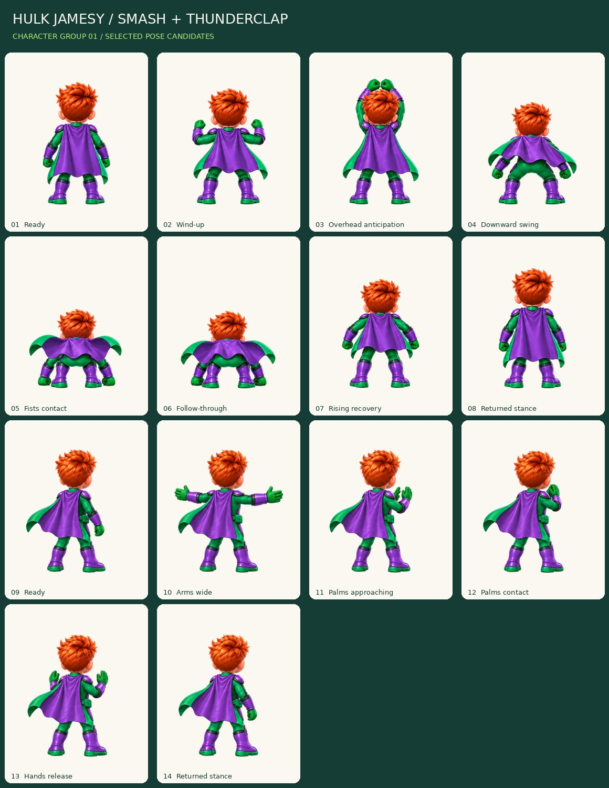

# Hulk Jamesy — Smash and Thunderclap / Actions 05

**Status: motion_review. Fourteen selected drawing candidates; not production-ready.**

[Open the self-contained action reviewer](review-export/review.html). It starts paused. Choose Smash or Thunderclap, step through poses, or play once and hold the final pose. Background, size, speed, root-guide and pose-strip controls are included. All images are embedded; no game, account or network connection is required.

## New artwork

| Action | Selected poses | Reading order | View |
| --- | ---: | --- | --- |
| Smash | 8 | Ready, wind-up, overhead anticipation, downward swing, fists contact, follow-through, rising recovery, returned stance | Rear |
| Thunderclap | 6 | Ready, arms wide, palms approaching, palms contact, hands release, returned stance | Rear three-quarter |

Smash's two green fists are visible at ground contact outside the boots. The slightly turned Thunderclap pose makes the palms readable beyond the shoulder. Both actions use the established orange hair and green/purple costume, with no added cape-back emblem. Dust, shockwaves, glow and sound are not painted into the bodies: those are separate later assets.

The two original source PNGs are preserved unchanged. `sources.json` records generation task IDs, exact dimensions, byte counts and SHA-256. Source reading order is retained within each action. A return pose is an authored source drawing, not a duplicate silently added to increase the frame count.

## Review exports

Fourteen RGBA PNG masters at 512x640 and matching 256x320 copies; one 1056x1312 review atlas with four-pixel cell gutters; separate and combined contact boards; a source/placement manifest; technical checks; and an offline reviewer. Alternate resolutions and the atlas are not additional unique drawings.

The proposed pivot is (0.5,0.9). One uniform scale is used per source sheet: 0.62 for Smash and 0.60 for Thunderclap. Ground/root translations and source rectangles are explicit. No per-pose silhouette fitting, whole-character mirroring, limb warping, hidden interpolation or new physics is applied. Cross-sheet body scale and final track-camera alignment still need acceptance.

Exterior white and annotated arm/cape negative spaces are removed while enclosed highlights are preserved. Neutral source-plate shadows below the soles are removed separately. Straight-alpha runtime pixels are copied into the atlas without a second alpha multiplication. Hair, hand and cape edges were inspected on dark and light backgrounds.

## Motion review — still open

Smash needs a shared review of overhead-to-downswing spacing, stance width/foot-placement drift and the abrupt cape lift at impact. The contact and follow-through are usable pose studies, not proof that the full movement is ready to ship.

Thunderclap's release spreads the hands wider than the requested small separation. Arm spacing, hand anatomy, shoulder/head orientation and cape continuity need final review in motion and at gameplay size. Its three-quarter view must transition deliberately from the rear running view; the game camera itself must not jump to a new angle.

Contact indices in the manifest are review labels only. They do not trigger damage, score receipts, effects or cooldowns. The simulation will continue to own those events during later integration.

## Executed checks

All 28 individual PNG exports passed dimensions, alpha-extrema and canvas-margin checks. All 14 atlas regions match their runtime PNGs. Both original source checksums were preserved. Twelve synthetic unit tests cover clip counts, one-shot flags, contact bounds, roots, image/atlas validation, alpha copying, interior-white preservation, negative-space handling, path scope and fixed-canvas placement.

Sixteen local Chromium viewer checks passed, including paused startup, loading all fourteen PNGs, stepping, play/pause, final-pose hold for each action, replay, both clip selectors, checker background, size/guide/strip controls, 390px portrait and 844px landscape page width, and no uncaught script errors or external requests. The tested HTML checksum is in `review-export/browser-checks.json`; the test is reproducible with `production/actions05/browser_check.py`.

The archive workflow runs exporter/unit checks. Browser checks are a separate local run. None of these checks is production art approval, physical iPhone/Safari testing, or a rebuilt-game performance test.

## Next character sub-batch

Power-up (six poses) and bump reaction (three), still keeping effects separate. Then victory (eight) and menu idle (four), followed by a unified Hulk motion/camera/scale review. Continue the other four costume families before items. No main deployment, Firebase, roster, account or score change is part of this batch.
