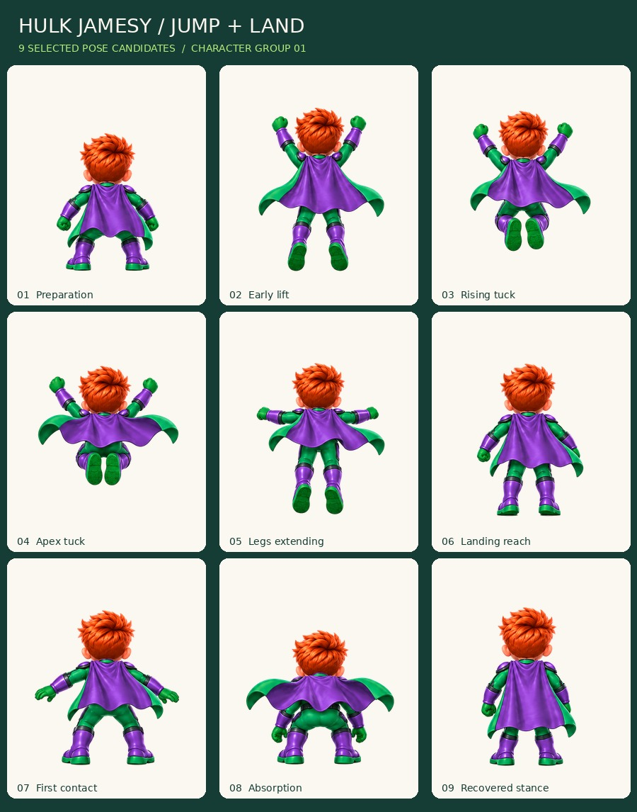

# Hulk Jamesy — jump and landing / Jump 04

**Status: motion_review. Nine selected drawings, not a production-approved animation.**

[Open the self-contained reviewer](review-export/review.html). It starts paused and supports the full nine-pose sequence, the six jump poses, or the three landing poses. Play runs once and holds the last pose; Replay starts over. Frame stepping, half-speed review, three backgrounds, display sizes and a pose strip are included. It uses embedded PNGs and makes no network, account or score requests.

## Actual source and selection

One nine-pose source was generated using the corrected J-emblem character reference and the established rear-view costume sheet. The 2560x2560 original is preserved unchanged as `source-sheet.png`; task ID and checksum are in `sources.json`.

Reading order is preserved: preparation, early lift, rising tuck, apex tuck, legs extending, landing reach, first contact, absorption, recovered stance. The second source drawing already has both feet off the floor; it is deliberately called **Early lift**, not a successful toe-contact push-off. Landing uses bent knees and upright recovery, not a two-fist Smash.

All drawings face away from the camera; the chest emblem is naturally hidden and no emblem was added to the cape back. Green suit, purple armor/boots, green soles and purple cape exterior with green lining are retained.

## Export and alignment

Nine 512x640 RGBA masters and matching 256x320 copies; one 792x984 review atlas; source rectangles, provisional roots, selected phases and alpha/canvas checks. Two resolutions are alternate exports, not 18 unique poses. The selected candidate count is nine.

A single uniform scale of 0.60 applies to this source sheet. Translations are recorded, with proposed output pivot (0.5,0.9). No character mirroring, per-pose fitting, limb warping or invented in-betweens are used. The source's row boundaries were inspected before extraction so hair near a nominal grid boundary is not cut off.

Exterior white background and explicitly checked negative spaces are removed; interior highlights are preserved. Neutral source-plate shadows are removed beneath grounded poses. The original source stays intact. Transparent edges were reviewed on contrasting backgrounds. A few-pixel alpha check is not a guarantee of final compositing quality on every future world.

## Motion and integration limits

These are **pose-only samples**. The game simulation must supply the jump's vertical path and collision timing; the review tool does not invent a physics arc or double-apply height. Jump preview timing is eight frames per second and landing twelve; this does not change live gameplay timing.

The takeoff-to-lift transition is abrupt, and cape transitions, head/limb proportions across poses, contact timing and final track-camera registration remain open for the unified movement-polish pass. The landing silhouette clearly separates first contact, deeper absorption and recovered stance, but that is not release approval.

## Executed checks

18 individual PNG exports passed dimensions, true alpha, nonempty silhouette and canvas-margin checks. All nine atlas regions match their runtime PNGs. The source checksum remains unchanged. Eleven synthetic export/unit tests passed.

Fifteen local Chromium checks passed for the self-contained viewer: loading, paused startup, stepping, play/pause, one-shot ending, replay, jump/land selection, backgrounds, display size, anchor and strip controls, 390px portrait and 844px landscape layout, and no uncaught errors or external requests. The tested HTML hash and exact checks are in `review-export/browser-checks.json`; `production/jump04/browser_check.py` reproduces the local check. CI repeats unit/export checks, not browser checks. No physical iPhone/Safari or live-game performance claim is made.

## Next character batch

Smash (eight planned frames) and Thunderclap (six), with the same rear-view identity and separate effects. Keep the outstanding movement-polish notes open. Then finish power-up, bump, victory and menu idle before expanding the remaining four costume families. Items, environments, interface art and effects remain later groups.

This batch changes only the art library, its tooling and the art-only archive workflow. No live game, Firebase configuration, player roster or scores are modified.
