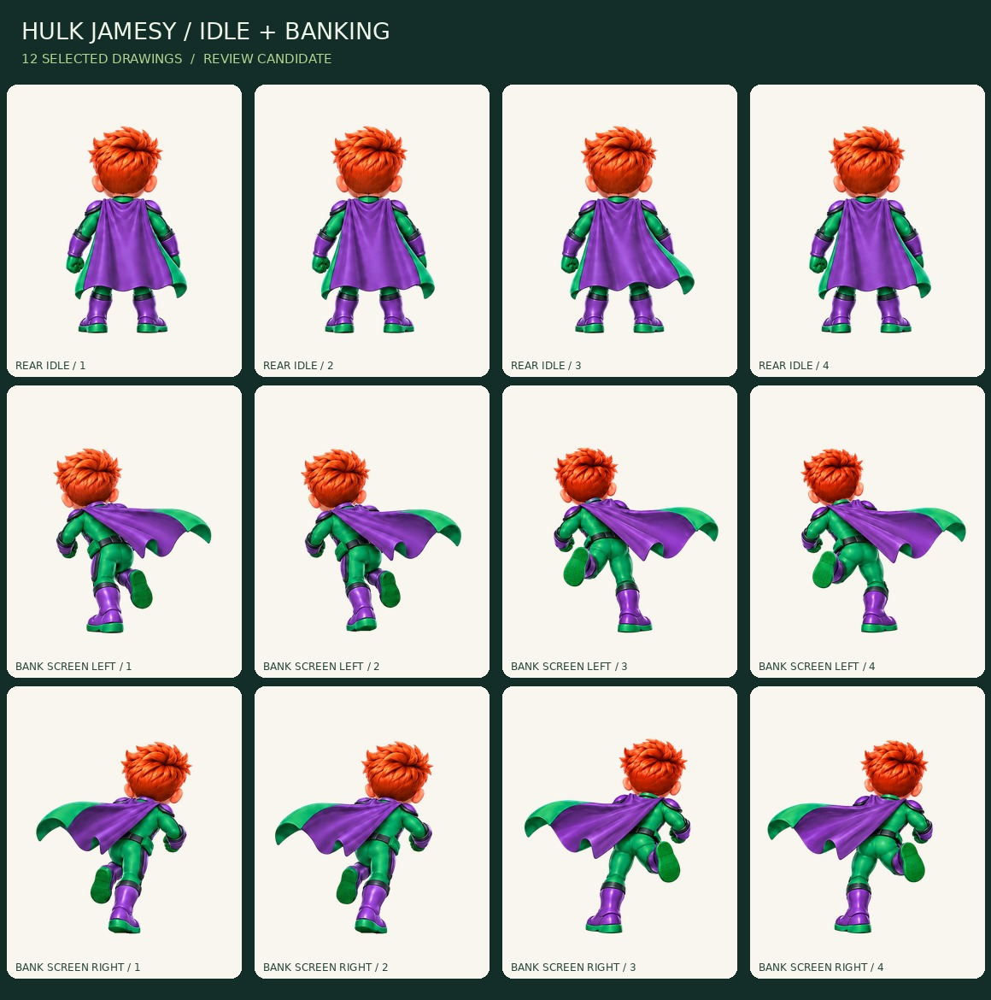

# Hulk Jamesy — rear idle and banking / Movement 03

**Status: motion_review. Twelve selected drawing candidates; not production-ready.**

[Open the self-contained reviewer](review-export/review.html). It starts paused. Choose Rear idle, Bank toward screen left, or Bank toward screen right. Step frames, play at 6/12/16 fps, inspect all four together, change display size, and compare dark/light/checker backgrounds. It uses embedded PNGs with no network or account requests.

## New character artwork

Four rear idle poses; four screen-left bank poses; four screen-right bank poses. The latter two sets include **both supporting feet**, not four repetitions of the same contact. Both banks were drawn separately; no complete character was mirrored. Green/purple costume, orange hair, green soles, purple cape exterior and green lining remain. No badge has been added to the rear cape.

The intermediate twelve-pose sheet and its full-sheet edit repeated the same support foot. A focused four-pose request supplied the missing opposite-foot configurations. The selected bank set combines the first two poses from each bank row with its two new complementary poses. The failed full-sheet leg correction is not credited as having fixed the stride.

## Exact selected source mapping

| Clip | Selected source cells, one-based | Preview fps |
| --- | --- | --- |
| rear_idle | source-sheet.png: 1, 2, 3, 4 | 6 |
| lean_left | source-sheet.png: 5, 6; source-opposite-steps.png: 1, 2 | 12 |
| lean_right | source-sheet.png: 9, 10; source-opposite-steps.png: 3, 4 | 12 |

All three original PNGs are archived unchanged. `sources.json` records exact task IDs, sizes, dimensions and SHA-256. The original supporting-leg order is retained within each selected pair; there is no concealed interpolation, frame retiming, limb warping or camera rotation.

## Export contract

12 RGBA PNGs at 512x640 and matching 256x320 copies, a 1056x984 review atlas, contact board, manifest and offline viewer. The two sizes are alternate exports, **not 24 unique poses**. Review pivot is (0.5,0.9). There is one uniform scale per source (0.78 for the twelve-pose sheet and 0.51 for the focused opposite-foot sheet), with explicit provisional ground/root translations. No frame-by-frame fitting to silhouette bounds is used.

White background is removed from the exterior while enclosed highlights remain. Neutral source-plate shadows just below the soles are removed separately; the ground shadow will be a separate game asset. Runtime pixels are packed without multiplying fractional alpha twice.

## Motion review and remaining polish

The idle is deliberately subtle, mainly breathing/cape movement. Banking now changes supporting foot. Four frames provide two contact-like pairs, however, not a fully detailed eight-phase running stride. Compression, limb proportions across the two sources, cape timing at the pair changes, the 4-to-1 seam and consistency with Run 02 still need motion polish. Standing and bent banking silhouettes differ in projected height; final track-camera and collision alignment are not yet approved.

The actual source art is preserved so these issues remain inspectable. No script promotes a pose to production-ready because it passes a file check.

## Executed checks

24 individual PNG exports passed dimension, alpha-extrema and canvas-margin checks. All 12 atlas regions match their runtime PNGs. The exporter verifies the source hashes. Ten synthetic unit tests cover masking, negative space, pivot placement, bounds, path scope, atlas alpha copying, source-plan counts and floor-shadow cleanup.

13 local Chromium viewer checks passed: image loading, initially paused playback, stepping, play/pause, all three clip selectors, background/size/strip controls, 390px portrait and 844px landscape layout, no uncaught errors and no external requests. The tested HTML checksum is in `review-export/browser-checks.json`; tests are reproducible with `production/tools/movement03_browser.py`. This is not a physical iPhone/Safari or game-performance test. CI repeats export/unit checks; the browser checks are a separate local run.

## Next character sub-batch

Jump (six frames) and landing (three frames), using the established costume and rear camera. Keep the current run/bank cadence and cape-polish notes open for the later unified movement review. Then continue the remaining Hulk actions and the other four character families before items. The art bible remains v1.2; this batch changes no game rules, live app, Firebase setup, players or scores.
