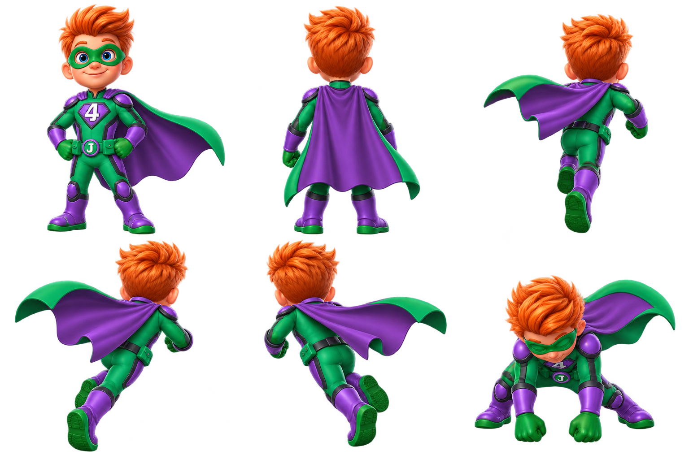

# Hulk Jamesy — first pose review

**Status: needs revision. Not approved and not production-ready.**

The original PNG is retained with its real alpha channel. The colored RGB visible in some viewers behind transparent areas is not proof of an opaque background; inspect the alpha composite. It is still a pose-review sheet, not a registered animation atlas.

## What this first batch actually contains

Front standing; rear standing; rear running key pose; two opposite rear running banks; a front-facing crouched two-fist contact study. The lower-right pose is **not** the requested rear-three-quarter Smash. The bottom-left figure banks toward screen right; the bottom-middle figure banks toward screen left. Do not label them by the original requested slot names without checking the actual drawing.

## Corrections required before approval

- Replace every visible chest **4** with the upright white **J** specified by the current bible. Keep the belt J. The new sheet incorrectly reused the original numeral.
- Produce the missing **rear-three-quarter Smash-contact** view. Keep the front contact study only as an additional pose, not a substitute.
- Check the cape's purple exterior and green lining against the accepted lineup, with consistent construction in all views.
- Register camera, body scale and foot anchor before extracting runtime frames. Do not crop the board into six cells and call that an animation.
- Check the exact left/right bank ordering, hair silhouette and hand/boot scale in the next pass.

## Separate visual study

A second generated [visual-study poster](../archived-studies/hulk-visual-study-v01-superseded.png) is archived only to preserve the requested artwork record. It is **superseded and not an art bible**: it has obsolete 4 emblems, a cape-back badge that is not approved, and unsupported pose/UI details. Its printed v1.0 heading does not supersede the written v1.2 bible. Do not use it as the identity reference or as finished animation frames.

## Next sub-batch

Correct J emblems and the missing rear Smash pose first; review the resulting construction. Then make the eight-frame rear run proof, followed by the remaining character packages. Items remain queued. No game, account or score changes are authorized by a pose-file upload.
