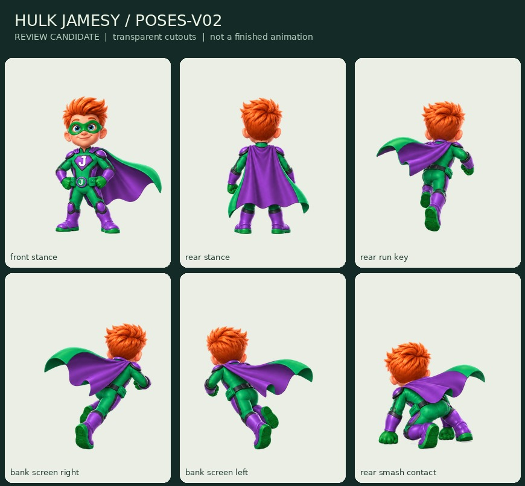

# Hulk Jamesy — corrected poses and transparent review cutouts

Status: **pose review**, not production approval. Source: `hulk-six-pose-v02-source.png`, task `35c32e2d-2a1d-4f88-9463-c3dc75e2076d`.

The visible chest J now agrees with the belt J. The former front crouch is now a rear-three-quarter contact study, with both fists visible. The source's front stance remains almost frontal rather than a fully established front-three-quarter camera. The rear cape has no emblem.

## New files

`v02-cutouts/` contains six individual transparent poses at 512x640 and 256x320, a review atlas, source rectangles/ground-anchor annotations, a labeled contact board and a self-contained `review.html` viewer. The exporter uses one scale for this entire sheet and explicit translations; it does not independently fit silhouettes, mirror poses or invent new movement.

Slot order is front stance, rear stance, rear-run key, **bank toward screen right**, **bank toward screen left**, rear Smash contact. Banks are named from the actual drawing rather than the original requested grid slot.

## Transparency

The source is retained intact with its white background. Review derivatives remove the exterior plate and four annotated negative spaces. Enclosed white eyes and J emblems are retained; boundary pixels receive a narrow white-matte cleanup. All 12 individual PNG exports have real alpha, nonempty silhouettes and canvas margins. Source hashes and technical checks are recorded alongside the files.

## Still to review

Exact front-three-quarter camera, grounded/in-air anchor assumptions, correspondence with the eventual track camera, costume construction and motion transitions. Six pose cutouts are NOT six completed animation clips and do not count toward the 64 approved runtime frames.

The previously failed background-removal request produced no usable asset. These cutouts were prepared deterministically from the successfully archived source, not attributed to that failed task. No generated video or live-game edit is part of this batch.
