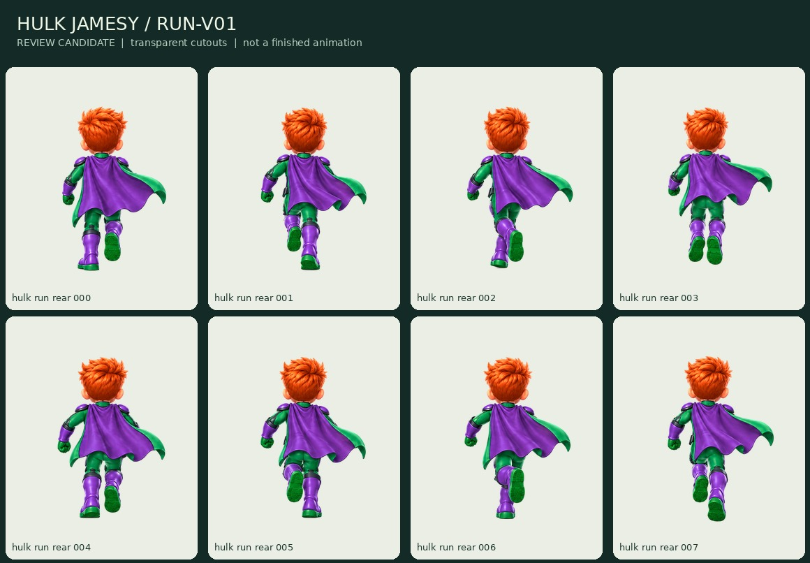

# Rear run v01 — transparent motion-review package

Status: **motion_needs_revision**. Eight source drawings, **zero production-approved frames**. Source task `70752a33-bd71-4481-b558-3f01c87c1a6e`; original bytes remain in `source-sheet.png`.

## Delivered for inspection

Eight transparent 512x640 candidate frames and eight 256x320 review exports; a 1056x656 atlas with four-pixel cell gutters; frame rectangles, per-source ground-anchor annotations, file checksums and a self-contained browser viewer. The common proposed output pivot is (0.5, 0.9). The original reading order is unchanged. Translation and a common sheet scale are applied, not pose warping, mirroring or per-frame bounding-box fitting.

Open `review-export/review.html`. It starts paused, supports frame stepping, 6/12/16 fps playback, three backgrounds, 120/180/320px canvas heights and a ground-anchor overlay. It plays existing sprite frames; it does not generate a movie or contact Firebase. The 120/180 values describe canvas height, not the exact silhouette height.

## Motion findings — hold before expanding clips

The sheet did not follow the requested eight sequential phases reliably. Frames 000/004 repeat a left-support pattern; 001/005 repeat the opposite-support pattern; 002/006 repeat similar passing-looking poses. Frame 003 lifts both boots symmetrically and reads as a hop. The last frame does not supply the intended matching second flight transition. Cape/shoulder motion and arm swing need a coherent sequence; proposed registration reduces page-layout drift but does not repair the drawings.

Do NOT merely reorder these and declare a finished run. Produce/correct a controlled eight-phase sequence with two alternating contacts, supporting-leg compression, passing and asymmetric flight phases. Keep the same camera, body scale, hair and cape attachment. Review the wrap from 007 to 000 before multiplying the defect into all other clips or costumes.

## Scope of checks

Technical checks cover actual file presence, dimensions, nonempty alpha and no canvas clipping. Eight synthetic masking/packing tests cover enclosed whites, negative-space seeds, path bounds, anchor placement and straight alpha. Twelve local Chromium viewer assertions cover loading, stepping, pause/play, backgrounds, 390px layout and lack of network requests across the two viewers. These are not physical iPhone tests and do not approve the run animation.

## Next sub-batch

Correct the eight-phase rear run first, using these isolated frames and the established lineup for comparison. Then continue the remaining Hulk clips and the other four character families. Items remain queued. The 12-clip / 64-unique-frame plan remains unchanged.
