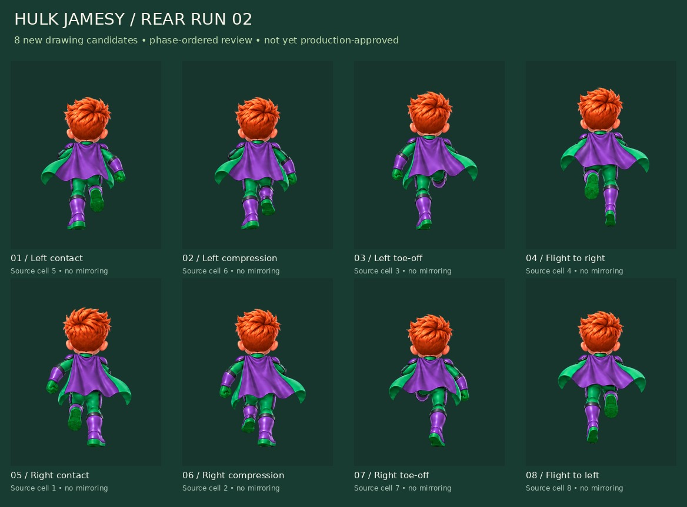

# Hulk Jamesy — rear-run revision 02

**Status: motion review. Not final production approval.**

[Open the self-contained reviewer](review-export/review.html). It starts paused, supports 6/12/16 fps, frame stepping, small/large display sizes, three backgrounds, original-source ordering and a previous-v01/new-v02 comparison. The [GIF](review-export/run-proof.gif) is a flipbook of these sprite PNGs, not a generated video.

## What changed

Two new source sheets were generated from the corrected J-emblem costume reference. The second request specifically revised tucked legs, toe-off and flight drawings. The original PNGs are archived unchanged as `source-intermediate.png` and `source-sheet.png`.

Their actual poses did not follow the requested cell order exactly. The export therefore uses source cells **5, 6, 3, 4, 1, 2, 7, 8** (one-based) to study left contact/compression/toe-off/flight, then the opposite step. Unlike the old v01 sheet, this source contains revised tucked-leg and toe-off drawings; this is not a relabel of the earlier eight PNGs. Phase labels are intended motion readings, not a guarantee of perfect anatomy.

## Export details

Eight new drawing candidates, each at 512×640 and 256×320 with genuine alpha; one 1056×656 review atlas; contact board; flipbook; manifest and checks. Alternate resolutions are not extra unique frames. The main art bible remains v1.2 and the Hulk plan remains 64 planned frames.

One scale of 0.59 is used across this sheet. Neck/root translations are explicit. Two flight poses have a declared -12 master-pixel presentation offset (6 runtime pixels). No whole-character mirroring, limb warping, hidden interpolation, new hitbox, score change or physics change is applied. Source rectangles, selected cell IDs, anchors and hashes are recorded in `review-export/manifest.json`.

White-background extraction preserves interior whites and explicitly removes small annotated negative spaces. Neutral plate shadows at the boot baseline are removed; ground shadows will be separate game assets. Edges were inspected on dark and light review backgrounds.

## Review outcome and next checkpoint

This is a more structured stride study with complementary half-steps and asymmetric raised feet rather than the old symmetric hopping frame. It is **not yet a release-approved run**. The cape changes direction noticeably around phase transitions, the amount of knee/hip compression is still stylized, and proportional continuity and the 8→1 seam need owner review at small gameplay size. Final ground/camera registration is deferred to the isolated game view.

Use the comparison viewer before accepting this run as the movement template for the other characters. After the run reference is accepted, the next character-only sub-batch is rear idle plus left/right banking clips, then jump/land and the remaining Hulk actions. Items remain deferred.

## Evidence and boundaries

The exporter executes 11 file/alpha/atlas/source-preservation checks. Seven synthetic unit tests cover source permutation, path scope, frame dimensions, alpha copying and interior-white handling. Twelve local Chromium reviewer checks passed; the browser report is saved alongside the exports. Local browser checks are not run by the art archival workflow and do not constitute physical iPhone/Safari or live-game testing.

No gameplay source, Firebase rules, roster, existing scores or main-branch deployment is changed. Sean remains the sole initial Master under the existing account design.
