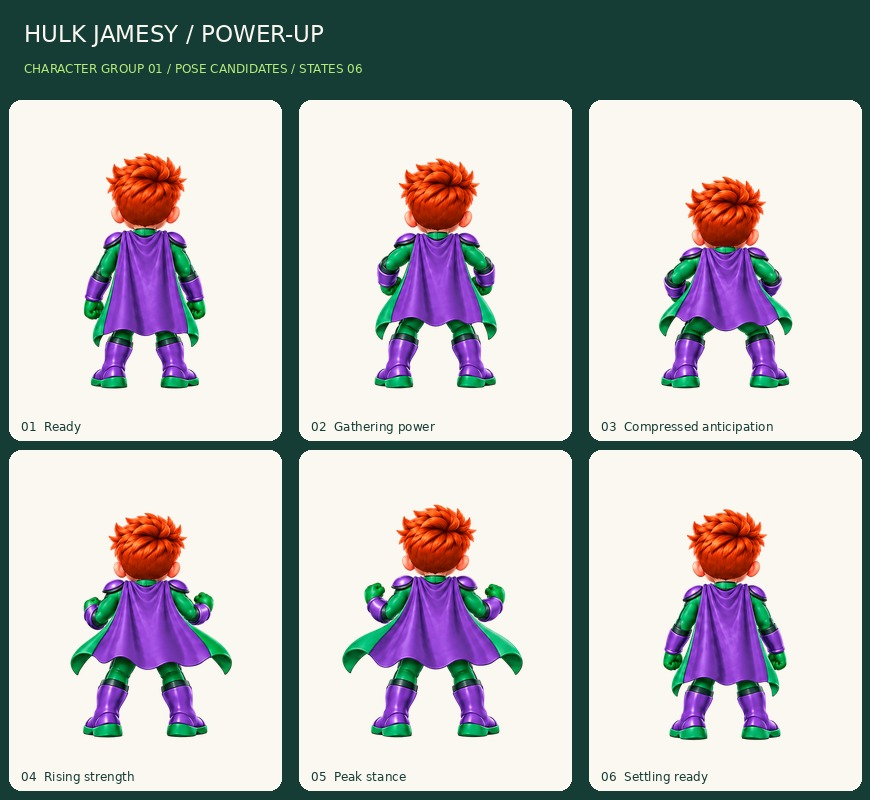
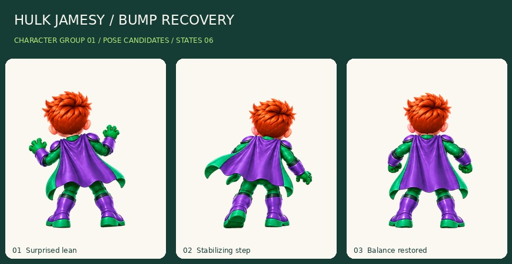
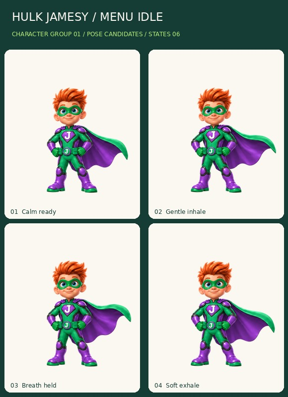

# Hulk Jamesy — States 06

**Motion-review candidates, not production-approved animation.** This batch adds thirteen selected drawings: six power-up, three bump-recovery and four menu-idle poses. The eight-frame victory request was not authorized, produced no task or image, and was not retried.

## Review the actual artwork

The [offline reviewer](review-export/review.html) embeds the images. Open the saved HTML in a browser: it starts paused, offers frame stepping, light/dark/checker backgrounds, image sizes and a pose strip. Power-up and bump stop on the final drawing; menu idle loops until paused. It does not connect to game accounts or submit scores.

## Delivered files

Three original PNG source sheets are retained unchanged, with task provenance, exact dimensions, byte counts and SHA256 values in [sources.json](sources.json). Their white backgrounds are source artwork, not claimed transparency.

The review export contains thirteen transparent 512x640 RGBA master canvases and thirteen 256x320 copies, a review atlas, per-frame source rectangles/roots, clip definitions, combined and individual contact boards, and a self-contained viewer. Resolution copies and atlases are not extra animation drawings.

One scale is used for each entire source sheet. Placement uses documented provisional foot/ground roots at pivot (0.5,0.9), not independent bounding-box fitting. Enclosed background gaps are explicitly annotated; white J lettering and eyes are retained. No limbs are warped, no bodies are mirrored, and no new in-between poses are fabricated. The front-menu sheet uses a smaller scale than the rear sheets to keep its wide cape inside the canvas; final camera integration remains separate.

## Visual inspection and open corrections

**Power-up:** six rear-view body drawings establish ready, anticipation, rising strength, peak and return. No aura, lightning or ground debris is baked in. Foot spacing and the knees/shoulders do not stay perfectly fixed; cape spread changes across poses. Smooth these transitions during the shared motion-polish pass rather than interpreting the strip as a finished power-up effect.

**Bump recovery:** a startled lean, stabilizing step and recovered stance. This is gentle surprise, not injury. The open gloves and step anatomy need close review; three drawings give a coarse transition that needs deliberate timing. Do not add flashing hit feedback.

**Menu idle:** all four visible chest and belt emblems read as J. The purple/green cape and exposed orange hair remain. Subtle face/cape differences and the fourth-to-first seam need a continuous-loop review. This front camera is for menus, not a substitute for the rear gameplay view.

All thirteen drawings were checked as full sheets, normalized contact boards and small dark-background previews. That inspection does not establish final likeness, seamless timing, a production camera match or owner approval.

## Verification

The local exporter passed 26 PNG dimension/alpha/margin checks, thirteen atlas pixel-region comparisons and three source checksum checks. Fifteen synthetic unit tests passed. Twenty-one local Chromium reviewer checks passed, including one-shot hold, menu looping, stepping, pause, background options and 390x844 / 844x390 viewport layout. The reviewer made no external requests.

[Technical file report](review-export/technical-checks.json) is generated by the exporter. [Local reviewer report](review-export/browser-checks.json) records the exact tested HTML hash. Browser tests are executed separately from the archival workflow; these are not physical iPhone/Safari tests or live-game regression results.

## Next gate

Hulk now has 56 selected sequence-drawing candidates across eleven clips of the planned 64-frame package. Victory's eight drawings are still missing. Obtain authorization before submitting that generation again. After victory, review all Hulk clips together for body scale, hair/face consistency, cape seams, limb contacts and timing. The four other costume families follow within the character group. Items stay queued.

The art bible v1.2 and existing game/account behavior are unchanged. No Firebase setup, roster change, score migration or deployment is part of this art batch.
