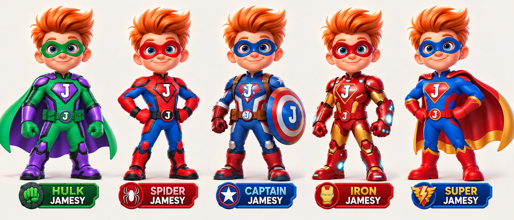

# Jamesy art library

The master art home for James Game Center and Jamesy The Hulk Racer. Kept on **art/storybook-bible-v1-20260928**, separate from the running game.

**[Art bible v1.2](../production/art-bible-v1/ART_BIBLE_v1.2.md)** · **[PDF](../production/art-bible-v1/Jamesy-Art-Bible-v1.2.pdf)** · **[Progress](PROGRESS.md)** · **[Inventory](inventory.json)**

## Sections

1. **Characters:** [Hulk](01-characters/hulk/), [Spider](01-characters/spider/), [Captain](01-characters/captain/), [Iron](01-characters/iron/), [Super](01-characters/super/).
2. **[Items](02-items/)** — queued until the character group is accepted.
3. **[Environments](03-environments/)** — complete layered world families.
4. **[Interface](04-interface/)** — titles, icons, Player Cards, Hall of Fame and controls.
5. **[Effects](05-effects/)** — shadows, particles and power effects, separate from sprites.

`00-reference` preserves original approved-lineup bytes plus an optimized WebP. Character reference crops retain their ivory background and may clip neighboring decoration at the crop edges; they are reference extracts, not isolated game sprites. New boards stay in `pose-reviews` until individually accepted.

**No art in this first archive is production-ready animation.** The JSON inventory records real files, sizes, dimensions, hashes and review status. Download this branch and open `gallery.html` locally for a visual index; GitHub itself does not execute that page.

Current storage is recorded by the inventory. Review at 250 MiB of current art or a source above 20 MiB. Those are project review thresholds, not hard hosting limits. Do not move artwork to Drive or enable paid large-file storage without discussing the change.
