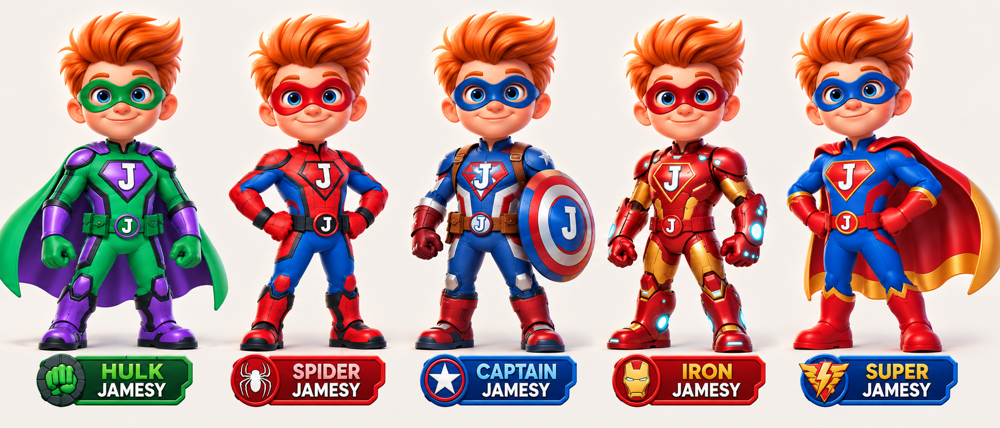

# Jamesy Visual & Asset Bible v1.2

28 September 2026 · Grouped art production

## Jamesy Art Bible

One hero. Five costumes. One consistent art library.

### The production decision

Finish the character-art group first, then the item group, then environments, interface artwork and effects. Assemble and test the game after the artwork is ready. Small animation-review tests are allowed within the character group; they do not move production ahead to items.

### Scope of this edition

This edition consolidates the J-emblem revision and the owner’s grouped-production request. It supersedes conflicting costume names, numeral-emblem directions and production order in earlier editions. It does not change gameplay, accounts, scores or Firebase rules.

### Working status

The lineup is the established visual reference. Character proofs and sprites need their own review. Planned assets are not delivered assets. The live racer remains separate from this art library.

## The order of work

### Group 1 — Characters

Hulk Jamesy, Spider Jamesy, Captain Jamesy, Iron Jamesy and Super Jamesy. Within this group, use shared camera and lighting templates for turnarounds, grounded poses, movement, special actions, expressions and presentation poses. Complete character assets before generating items.

### A practical way to preserve consistency

Work in controlled sub-batches: identity views across the roster; Hulk’s motion proof; matching movement packages; signature-action packages; then portraits and character-select poses. Every request reuses the same approved lineage. “Together” means a common reference and production session—not squeezing hundreds of tiny frames into one image.

### Group 2 — Items

Create collectible families together, then hazards together. Use the locked world palettes and a common camera/lighting recipe. Keep backgrounds and impact effects separate from item art.

### Groups 3–5 — Worlds, interface and effects

Build each world as a complete layered set. Then produce title screens, icons, Player Card frames, Hall of Fame decoration and UI controls. Finish the shared effect library. Keep meaningful text live rather than painted into images.

### Assembly comes last

Package only accepted sprites and layers for the isolated 2.5D preview. Verify controls, collision alignment, readability and frame pacing before changing the live app. No automatic deployment is part of an art approval.

## Identity that never drifts

### One child, five costumes

Keep the same large blue eyes, warm skin, friendly child face, swept orange-red hair, compact proportions and confident smile. Costumes change; Jamesy’s identity does not. Avoid adult musculature, face changes and closed helmets.

### Permanent J branding

Every chest and belt uses an upright white capital J. Captain Jamesy’s shield uses J too. The old age-based 4 is retired. Do not put a new J on the back of the cape merely to make it visible to the racing camera. Rear views naturally hide the chest. Never mirror lettering.

### Material and light

Dimensional storybook-arcade finish: softly rounded forms, broad highlights, gentle ambient shading, readable silhouettes and restrained texture. Use a soft upper-left screen-space light. Keep lighting stable from frame to frame; avoid hard photoreal metal and noisy costume surfaces.

### Color targets

Forest ink #153C35; emerald #119447; purple #7542B4; power lime #B6EC7A; warm paper #FAF7F0; hair orange #F1842D; cream gold #F4CD70. These are proposed working tokens, not sampled measurements. Preserve the established costume relationships over an arbitrary exact hex match.

## The character roster

| Hero | Keep consistent | Action vocabulary |
| --- | --- | --- |
| Hulk Jamesy | Green mask and suit; broad green gloves; purple armor and boots; purple cape, green lining. | Weighty run, leap, two-fist Smash, Thunderclap. |
| Spider Jamesy | Red mask; red/blue suit; exposed hair; compact gloves and boots; no cape. | Agile run, lean, leap; web-themed action studies later. |
| Captain Jamesy | Blue mask and suit; cream/red panels; brown straps; round J shield; no added cape. | Run with shield, guarded lean, shield-action studies. |
| Iron Jamesy | Red eye mask; rounded red/gold armor; cyan accents; open face and exposed hair. | Run, braced landing, booster and wrist-action studies. |
| Super Jamesy | Blue mask and suit; red gloves and boots; red cape with gold lining. | Upright run, sweeping cape, sky-action studies. |

### Names and silhouettes

Use descriptor-first names exactly as listed. Keep the product titles James Game Center and Jamesy The Hulk Racer. The five costume designs are not five player accounts.

### Art scope versus gameplay scope

Create the full character art library now, but do not imply that all costumes are already playable. New signature moves are visual studies until they have deliberate gameplay specifications. Keep the current ranking rules separate from experimental abilities.

### Power-state naming

Use “Supercharged” as a proposed shared power-state label so it is not confused with the roster character Super Jamesy. A documentation change does not silently rename the existing live game’s messages.

## Hulk first: pose proof

### The six-view proof

Front three-quarter standing; straight rear standing; rear running key pose; rear bank left; rear bank right; and rear three-quarter Smash contact. Review these together before expanding their shapes into animation. The extra running key pose complements the earlier five-view specification.

### Review conditions

Quiet ivory studio background, generous spacing, complete silhouettes and matching scale. No aura, debris, explosion, scenery or large shadow may conceal the costume. The rear cape exterior stays purple, with green edging and green lining visible only where the cape turns.

### What must agree

Hair sweep, head size, gloves, boots, shoulder armor, waist height and cape attachment. Left and right banks are separately authored. Both padded fists must make readable ground contact in Smash. The rear camera must not unexpectedly become a front-facing shot.

### What a proof is not

A model-sheet board has a background and presentation spacing. Cropping it does not automatically make registered transparent animation frames. Label every proof candidate honestly; it becomes a production sprite only after cleanup, alignment and approval.

### Next within the character group

Once the pose construction is accepted, create eight rear-running frames with alternating foot contacts and a seamless loop. Review actual playback before expanding the remaining clips. Continue the other four character families before starting item generation.

## The animation package

| Clip / view | Frames | Preview timing |
| --- | --- | --- |
| Rear idle | 4 | 6 fps / loop |
| Rear run | 8 | 12 fps / loop |
| Rear lean left | 4 | 12 fps / loop |
| Rear lean right | 4 | 12 fps / loop |
| Jump | 6 | 8 fps / one shot |
| Land | 3 | 12 fps / one shot |
| Smash | 8 | 12 fps / one shot |
| Thunderclap | 6 | 12 fps / one shot |
| Power-up pose | 6 | 12 fps / one shot |
| Bump reaction | 3 | 10 fps / one shot |
| Victory / front three-quarter | 8 | 10 fps / one shot |
| Menu idle / front three-quarter | 4 | 6 fps / loop |

### Reuse deliberately

Fast run reuses the eight-frame run at a 16 fps preview rate. Level intro reuses menu idle. These are not additional unique frames. The current saved Hulk schedule is 64 unique frames, not the 58-frame draft that appeared earlier.

### Other character families

Use the same common movement states and ground anchor across all five. Their signature-action clips must be specified and reviewed per costume; do not describe four more finished 64-frame sets as already produced.

### Timing ownership

The table defines art-preview timing, not physics. The simulation controls jump height, collision, movement, cooldowns and scoring. Cosmetic frames must never create extra hits, extra score receipts or an unresponsive input delay.

## Sprite export contract

### Fixed canvases

Proposed source frame: 512 × 640 pixels, RGBA PNG. Runtime frame: 256 × 320. Common foot/ground anchor: normalized (0.5, 0.9), source (256, 576), runtime (128, 288). Keep a common body scale; do not independently fit every pose to its own bounding box.

### Views and perspective

Use rear or rear-three-quarter artwork for gameplay and front-three-quarter for menus. “Camera-facing sprite” describes the image plane, not the direction the character is looking. Register the camera pitch on the track before finalizing animation frames.

### Transparency and compositing

Remove the background without erasing costume edges. Inspect hair, fingers, cape gaps and boot soles on light, dark and checker backgrounds. Ground shadows, glows and impact effects are separate layers. A painted checkerboard is not transparency.

### Atlas planning

At 256 × 320 with a 4-pixel gutter on every side, a cell occupies 264 × 328. A 2048-square page holds 7 × 6 = 42 cells; the 64-frame Hulk set fits in two pages. Two RGBA pages occupy 32 MiB before mipmaps and other rendering resources. This is calculated planning, not a device performance measurement.

### File contract

Use names such as hulk_run_rear_000.png. Save frame rectangles, pivots, clip order, source reference, version and approval state in a manifest. No automatic trimming, rotation or mirrored poses. Keep production exports separate from original proof sheets.

## Items are the second group

| World | Rewards | Hazards |
| --- | --- | --- |
| Emerald Skyway / park / 0 | Green power gems; gold stars. | Mossy rock; dark bumper; violet goo. |
| Crystal Cavern Run / cavern / 1 | Blue shards; pale moon crystals. | Rock-based crystal blocker; violet bumper; goo. |
| Volcanic Jungle Dash / volcano / 2 | Amber sunstones; golden suns. | Lava-cracked dark rock; warm-lit bumper; goo. |

### Produce families together

First all six reward designs, then all nine hazard designs. Match scale, camera pitch, light direction and finish. Review each family against the locked character art before doing rotation or pulse loops. These are planned sets, not completed images.

### Readability beats decoration

Rewards have distinct clean silhouettes. Hazards have weight, broken outlines or dark bases. Crystal hazards must not resemble reward crystals. Do not rely on green versus red alone. Keep sparkles and glow off the core silhouette until readability passes.

### Depth behavior

Objects should read at near, middle and far route sizes. Keep the contact pivot and intended collision footprint in metadata. Decorative highlights must not enlarge the gameplay hitbox.

### Not yet in production

No item generation starts until the character group reaches its agreed acceptance gate. This preserves the user’s requested section-by-section workflow.

## Worlds, interface and effects

### Three complete environment kits

Each world gets sky/backdrop, far landmarks, midground, near decorative props, track material and a depth-aware gateway. Emerald is a sunny city-park; Crystal is cool luminous stone; Volcanic Jungle is tropical foliage with distant lava glow. Avoid painting gameplay objects into a static background.

### Preserve the route

The character and incoming obstacles own the center. Decorative leaves, waterfalls and bridge supports must not hide the next decision. Use restrained parallax and grounded shadows to sell depth, not constant camera shake or large roll.

### Interface family

Title art, character-select portraits, icons, sharing art, button surfaces, ability symbols, Player Card frames and Hall of Fame decoration share the same material language. Keep names, numbers, ranks and roles as live accessible text.

### Compact HUD

Landscape: small score above left steering, power above right actions, pause in a safe corner. Portrait: a compact top information strip and separated lower controls. Proposed controls: 56 CSS pixels for primary actions, 44 for secondary actions, with spacing and visible focus. Verify rather than assuming the values guarantee accessibility.

### Effects last

Create a shared contact shadow, pickup sparkle, thin Smash ring, clap pulse, steady power aura and victory accent. Gentle Effects removes flashes, shake and dense particles while retaining meaningful state feedback. Never hide a costume inconsistency behind glow.

## Protect the player experience

### Current application baseline

The saved v1.3 project uses email/nickname matching with Anonymous Authentication and Realtime Database under jamesV1. Sean is the sole initial Master. Preserve this baseline; do not reintroduce the old Firestore or Google-sign-in proposal as part of an art pass. [R1–R2]

### Hall of Fame

Preserve Most Points, Most Adventures, Most Worlds Completed, Highest Average, Highest Single Run and Longest Clean Streak. Little Hero and Superhero stay separate; tied rankings and the existing average-score minimum stay intact. New art never invents scores or resets a board. [R3]

### Player Cards

Keep nicknames, role badges, lifetime statistics, per-world scores and earned medals. Character portraits are decoration—not access privileges, personal identities or automatically created accounts. Empty records remain honest empty states.

### Integration boundary

Keep community.beginRun() at the race start and the once-only finish guard around local and account-record recording. Animation callbacks may trigger cosmetic effects, never persistence. Preserve account-bound retries and practice/registered separation. [R4]

### No setup change needed

Reviewing this art library does not require new Firebase rules, credentials, account provisioning or database migrations. No private email, matching credential or personalized rules file belongs in the public art repository.

## A library we can resume

| Location | Purpose |
| --- | --- |
| art/00-reference/ | Original lineup and optimized reference image. |
| art/01-characters/<hero>/ | References, pose reviews, frame sources and accepted sprite exports. |
| art/02-items/ | Collectibles and hazards, grouped by family/world. |
| art/03-environments/ | Complete layered world kits. |
| art/04-interface/ | Menus, icons, Player Cards and Hall of Fame art. |
| art/05-effects/ | Separate shadows, particles and power effects. |
| production/art-bible-v1/ | Versioned decisions, animation schedule and this bible. |

### Every asset has a status

reference: an established identity guide; candidate: generated or edited and awaiting review; approved_source: visually accepted; production_ready: cleaned, registered, packaged and checked in motion. No script may convert candidate to approved merely because a file exists.

### Every handoff has evidence

Record asset ID, source reference, revision, intended pose/view, dimensions, alpha status, file hash and review notes. Keep a human-readable progress ledger stating the exact next sub-batch.

### Storage policy

Keep lossless masters and optimized previews where practical. Avoid saving every rejected variation or a ZIP duplicate in repository history. Review storage at 250 MiB of current art or any single source above 20 MiB; these are project thresholds, not GitHub limits. Google Drive or Git LFS can be evaluated then, before moving anything. [T1]

## Quality gates and next action

### Character gate

Confirm the same face/hair, upright J marks, costume palette and cape construction. Compare both banks and contact poses at full size and at small gameplay size. Review real animation playback for body-scale drift, sliding feet, reversed details and broken loop seams.

### Export gate

Confirm all files exist, have the intended resolution and real alpha, use a stable pivot, and have no clipping or fringe on multiple backgrounds. Inspect the atlas and isolated frames. Approval of a still pose is not approval of the completed animation.

### Game gate — later

Check phone portrait/landscape controls, simultaneous steer-plus-jump, keyboard access, pause/resume, Gentle Effects, route visibility and sprite/collision alignment. Target smooth frame pacing, measure actual memory and test on a physical iPhone. Re-run account and score regressions before release.

### Current priority

Finish the first Hulk pose-review batch, approve its construction, then produce the eight-frame rear run proof. Continue through the remaining character packages. Items remain queued. Assembly waits until the artwork groups are ready.

### Release status

This is a preproduction art-library edition. It does not claim a rebuilt game, finished production sprites or an approved new animation set. The file inventory and progress ledger—not a previous promise—are the delivery record.

## References and decision log

### Owner decisions

2.5D storybook-arcade presentation; five-costume Jamesy lineup; descriptor-first names; J replacing the age numeral; character art first, then items; GitHub preferred for all artwork, with Google Drive only if storage warrants it.

### R1 — Racer baseline

https://github.com/seansommer/James-Hulk-Racer/blob/47d8291eadd9c0848dee38dc508b67f3129b6d11/README.md

### R2 — Hub baseline

https://github.com/seansommer/James-Game-Center/blob/40a1f4b2355e8e920ecd8a53cdc115cb47c75b49/README.md

### R3 / R4 — Ranking and receipt interfaces

src/shared/center-model.js and src/app.js at the R1 commit. Re-check the live repository before eventual integration.

### Prior art documents

production/art-bible-v1/ART_BIBLE.md, EMBLEM_REVISION_v1.1.md, PRODUCTION_PLAN.md and animations.json on art/storybook-bible-v1-20260928. This v1.2 edition updates their conflicting production order and naming.

### T1 — Storage reference

https://docs.github.com/en/repositories/working-with-files/managing-large-files/about-large-files-on-github

### Edition record

28 September 2026 • v1.2 • Scope: art specification and library organization. The lineup’s costume details are visual references; generated pose candidates require independent approval. Older PDFs and companion-kit claims are not evidence that those files are committed here.

